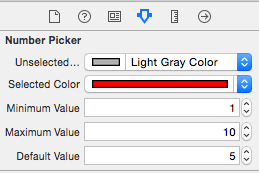

# RDNumberPicker

A simple, usable, number picker, for selecting from a list of sequential values, inspired by the way which the Airbnb iOS app allows you to select number of guests.

Structurally it's a simple wrapper for a UICollectionView, providing some convenience.

<p align="center"></p>

## Usage

To run the example project, clone the repo, and run the app from Xcode.

`RDNumberPicker` can either be used from Interface builder, or from code, in both cases the scrollable area is the entirety of the frame, although the size of the cells, labels and mask remain fixed and vertically centred within the parent, at 50px in height.

### Interface Builder

Drag a a UIView onto your view controller, change the class via `Identity Inspector` to `RDNumberPicker`. The view uses IB_DESIGNABLE so you should see where the ring mask will be placed, although not the associated values which you've configured.

Additionally you can configure `RDNumberPicker` via IBInspectable attributes:

<p align="center"></p>

- `minimumValue`: The minimum value for the control, inclusive
- `maximumValue`: The maximum value for the control, inclusive
- `defaultValue`: The default value to highlight when first loading the control
- `unselectedColor`: Color for text labels which are not selected
- `selectedColor`: Color for circular mask and text label when selected

### Code

An example usage:

```objc
RDNumberPicker *numberPicker = [[RDNumberPicker alloc] initWithFrame:CGRectMake(0, 0, 320, 80)];
numberPicker.minimumValue = 1;
numberPicker.maximumValue = 20;
numberPicker.defaultValue = 10;
numberPicker.unselectedColor = [UIColor lightGrayColor];
numberPicker.selectedColor = [UIColor colorWithRed:250.0/255.0 green:134.0/255.0 blue:140.0/255.0 alpha:1.0];
numberPicker.backgroundColor = [UIColor whiteColor];
numberPicker.numberPickerDelegate = self;
[self.view addSubview:numberPicker];
```

Callbacks can be handled from the protocol method:

```objc
- (void)numberPicker:(RDNumberPicker *)numberPicker didPickNumber:(NSInteger)value atIndex:(NSInteger)index;
```

The current control value can be accessed at any time using the property:

```objc
@property (nonatomic, assign, readonly) NSInteger currentValue;
```

Two convenience methods are provided to programmatically change the picker:

```objc
/* Programatically scroll to the number with associated value. If the value does not exist scrolling will not occur */
- (void)highlightNumberWithValue:(NSInteger)value animated:(BOOL)animated;

/* Programatically scroll to the number at a given index. If the index does not exist scrolling will not occur */
- (void)highlightNumberAtIndex:(NSInteger)index animated:(BOOL)animated;
```

## Known Issues and Future Improvements

- [ ] Strange rendering behaviour using IB_DESIGNABLE, `renderMask` explicitly called in `prepareForInterfaceBuilder` currently
- [ ] Configurable sizing, currently each cell is fixed at 50x50
- [ ] Descending list of numbers to scroll through, if desired
- [ ] Support for variable sized increments, not just 1
- [ ] Tests!

## Author

[@1RickyDunn](https://twitter.com/1RickyDunn)

## License

RDNumberPicker is available under the MIT license. See the LICENSE file for more info.
